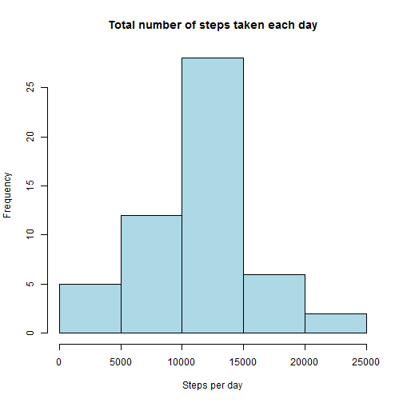
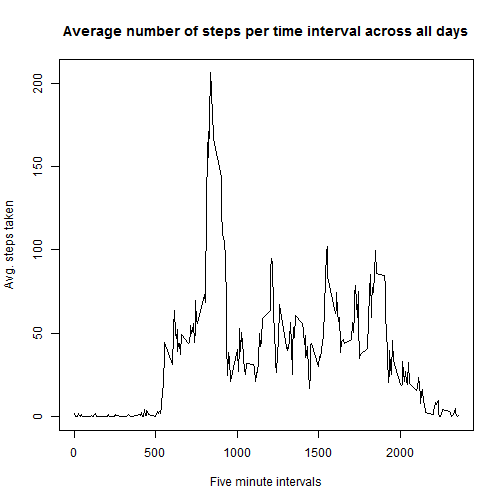
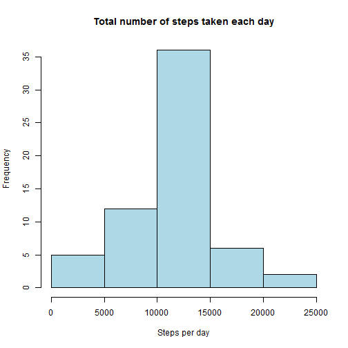
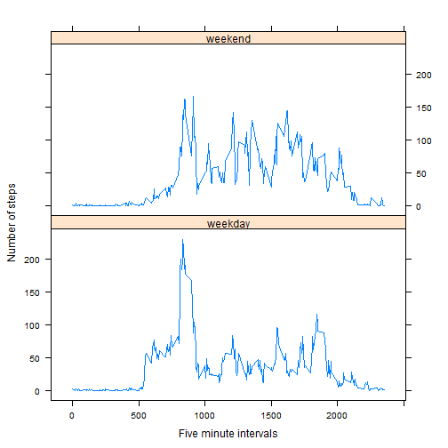

# Reproducible Research: Peer Assessment 1

<br>
## Loading and preprocessing the data

The following section of code depicts how to load the data set and perform necessary
preprocessing on it.


```r
# setting the working directory, change as needed
setwd("C:/Users/Deadman/Documents/GitHub/RepData_PeerAssessment1/")

# loading the data in data frame
data <- read.csv("activity.csv", header = TRUE, sep = ",", na.strings = "NA")

# transforming the date variable to Date format
data$date <- as.Date(as.character(data$date), "%Y-%m-%d")

# viewing details of the data frame
str(data)
```

```
## 'data.frame':	17568 obs. of  3 variables:
##  $ steps   : int  NA NA NA NA NA NA NA NA NA NA ...
##  $ date    : Date, format: "2012-10-01" "2012-10-01" ...
##  $ interval: int  0 5 10 15 20 25 30 35 40 45 ...
```

  
    
<br>
## What is mean total number of steps taken per day?

This sections consists of code to remove the missing values and plot a histogram of the number
of steps taken each day and report the `mean` and `median` of the number of steps taken each day.


```r

# removing the missing values
tidyData <- data[!is.na(data$steps), ]

# performing aggregation to get the total sum of steps for each date
stepData <- aggregate(steps ~ date, data = tidyData, FUN = sum)

# disabling scientific notation
options(scipen = 999)

# calculating the mean and median
meanStep <- round(mean(stepData$steps), 2)
medianStep <- round(median(stepData$steps), 2)

# plotting the histogram as required
h1 <- hist(stepData$steps, col = "lightblue", main = "Total number of steps taken each day", 
    xlab = "Steps per day")
```

 


From the above calculations, we obtain the following results.
 - __Mean__ total number of steps taken per day: ___10766.19___
 - __Median__ total number of steps taken per day: ___10765___


<br>
## What is the average daily activity pattern?

In this section, we will make a time-series plot of the five minute interval vs. the average number of steps
taken


```r

# calculating the average of steps for each time interval
avgStep <- aggregate(steps ~ interval, tidyData, mean)

# checking which five minute interval contains the maximum number of steps
# taken
maxRowIndex <- which.max(avgStep$steps)
maxInterval <- avgStep[maxRowIndex, "interval"]
maxAvgStep <- round(avgStep[maxRowIndex, "steps"], 2)

# plotting the time-series graph as required
plot(avgStep$interval, avgStep$steps, type = "l", xlab = "Five minute intervals", 
    ylab = "Avg. steps taken", main = "Average number of steps per time interval across all days")
```

 


Thus we observe from the data set that, on an average across all the days, the __'835'__ five minute interval contains the maximum number of steps i.e, __( 206.17 steps )__

<br>
## Imputing missing values

In this section we look closely at the missing data in our data set and see if the presence of missing data might cause any bias in our data, we also see the effects of imputing these missing values.


```r

# calulating the total number of missing values in the dataset
missingCount <- sum(is.na(data$steps))
```


The total number of missing values in the dataset are: __2304__

Now we will be filling in all the missing values of the data set. The strategy we used here was to fill the NA values with the mean of that particular five minute interval for that row in which the NA value is present. The following code
section shows that.


```r

# filling all the missing values in the dataset Strategy used: Fill the NA
# value with the mean of corresponding five minute interval

# getting the indexes with missing values
missingIndexes <- which(is.na(data$steps))

# getting the corresponding intervals
missingIntervals <- data[missingIndexes, 3]

# filling the missing intervals with the mean of the corresponding five
# minute interval
filledSteps <- sapply(missingIntervals, function(x) {
    avgStep[(avgStep$interval == x), 2]
})

# creating a new dataset that is same as the orginal dataset
newData <- data

# now filling in the missing 'steps' data which we just computed above
newData[missingIndexes, "steps"] <- filledSteps

# performing aggregation to get the new total sum of steps for each date
newStepData <- aggregate(steps ~ date, data = newData, FUN = sum)

# calculating the new mean and median of the total number of steps taken per
# day
newMeanStep <- round(mean(newStepData$steps), 2)
newMedianStep <- round(median(newStepData$steps), 2)

# plotting the histogram as required
h2 <- hist(newStepData$steps, col = "lightblue", main = "Total number of steps taken each day", 
    xlab = "Steps per day")
```

 

```r

# calculating the modes of the histograms
oldMode <- h1$counts[which.max(h1$counts)]
newMode <- h2$counts[which.max(h2$counts)]
```


From the above calculations, we obtain the following results.
 - __Mean__ total number of steps taken per day: ___10766.19___
 - __Median__ total number of steps taken per day: ___10766.19___  
 
<br>
Impact of imputing the missing data.
 - The mean number of steps taken per day are still the same ( __10766.19__ ). 
 - The median number of steps taken per day are slightly different now ( before: __10765__, after: __10766.19__ ).
 - Mode is much higher now ( before: __28__, after: __36__)

<br>
## Are there differences in activity patterns between weekdays and weekends?

In this section we will try to find out if there are any differences in the activity patterns between weekdays and weekends.


```r

# creating a new factor variable 'day' with two levels 'Weekday' and
# 'weekend'
newData["day"] = factor(sapply(newData$date, function(x) {
    if (weekdays(x) == "Sunday" | weekdays(x) == "Saturday") {
        "weekend"
    } else {
        "weekday"
    }
}))

# performing aggregating to get the number of steps for the time interval
# and day
avgStepDay = aggregate(steps ~ interval + day, mean, data = newData)

# loading the lattice package
library(lattice)

# plotting the data as required
xyplot(steps ~ interval | day, data = avgStepDay, type = "l", layout = c(1, 
    2), xlab = "Five minute intervals", ylab = "Number of steps")
```

 


From the above plot, we observe that there is a higher peak in the number of steps taken, between the `500` and `1000` five minute time intervals, ( i.e, early morning ) on weekdays rather than on weekends. Besides this, we can also observe that, higher peaks in the number of steps taken occur from late morning till evening, on weekends rather than weekdays which is expected.


